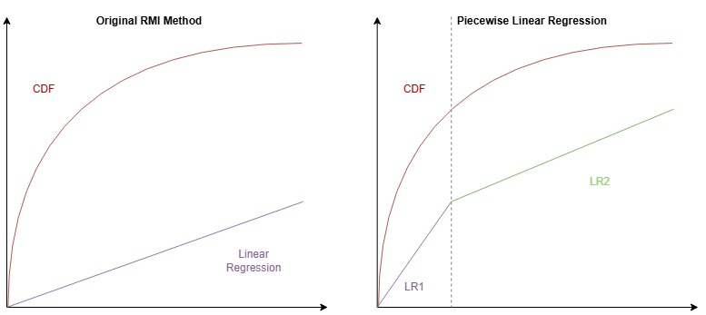

# Segmented Learned Index (LISA-hash)

This repository contains an experimental implementation of a **segmented (piecewise) linear learned index** for genomic hashing workloads. The main contribution is the transition from a single global linear model that approximates the key CDF to a **piecewise linear model**, where the key space is divided into multiple segments and each segment is modeled independently. This improves prediction accuracy for non-uniform key distributions and reduces the lookup error during index queries.

The segmented design better captures local variations in the empirical CDF, leading to smaller search ranges and more efficient memory access patterns. Detailed build and execution instructions, as well as usage examples, are provided in **`README_LISA-hash.md`**.
